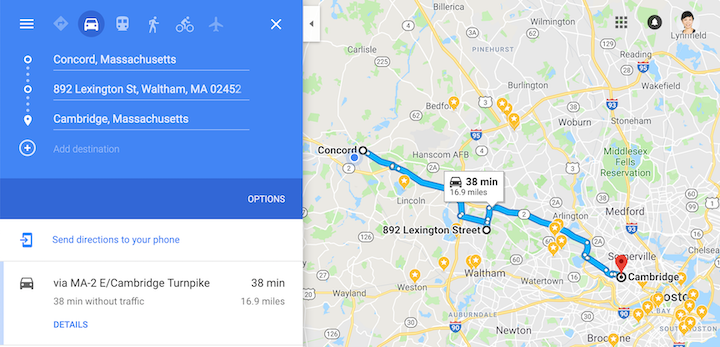

```{r setup, include=FALSE}
library(learnr)
knitr::opts_chunk$set(echo = TRUE)
# install.packages("dplyr", repos='http://cran.us.r-project.org')

gas <- read.csv("datasets/gas_stations.csv", header = TRUE, stringsAsFactors=FALSE)

options(tutorial.storage = filesystem_storage("/srv/shiny-server/tutorials/AAA_storage", compress = TRUE))
```


## The Challenge

> Gas prices change on a nearly daily basis, and not every gas station offers the same price for a gallon of gas. The gas station selling the cheapest gas may be a bit farther from where you are driving. Is it worth the drive for less expensive gas? Create a mathematical model that can be used to help understand under what conditions it is worth the drive (adapted from GAIMME Report, p.14).

## Gas stations data

To better understand the problem, you can explore this Gas Stations data set and use it to test your solutions.

This data set considers a trip from Concord, MA to Cambridge, MA. According to Google Maps, the best route is 14.7 miles long and takes 28 minutes. We identified 50 gas stations along the route. For each station, we used Google Maps to estimate the total distance and duration from Concord, MA to Cambridge, MA with a stop to buy gas at that station. Traffic was not considered for these searches. We used Google's location information to collect the address, gas prices, and hours of operation for each station. The data were collected on Feburary 20th, 2019.

Below are the descriptions of the variables in this data set:  

- **station**: the names of the gas stations. For duplicate names, the street numbers of the stations were added to make the names unique. For example, a Mobil at 143 Sudbury Rd, Concord MA and another Mobil at 22 Concord Turnpike, Concord MA were renamed as "Mobil 143" and "Mobil 22".
- **price**: the price of regular gas, U.S. dollars per gallon ($/gal)
- **open** and **close**: hours of operation
- **distance**: the total distance from Concord, MA to Cambridge, MA with a stop to buy gas at the gas station, in miles (mi). For example, to stop at "Gulf 892", the total distance is 16.9 miles, which is 2.2 miles more than the original non-stop distance, 14.7 miles.  
- **duration**: the total duration from Concord, MA to Cambridge, MA with a stop to buy gas at the gas station, in minutes (min). For example, to stop at "Gulf 892", the total duration is 38 minutes, which is 10 minutes more than the non-stop duration, 28 minutes.



Click 'Run Code' to view the data set:
```{r stations, exercise = TRUE}
gas
```

```{r arrange, exercise = TRUE}
library(dplyr)
arrange(gas, price, distance_gs2)
```


```{r gas-price, exercise = TRUE}
color = rgb(red = 1, green = 0, blue = 0, alpha = 0.5)
plot(x = gas$price, y = gas$distance_ttl, pch = 16, col = color)
text(x = gas$price, y = gas$distance_ttl, labels = gas$name, pos = 3, offset = 0.3, cex = 0.5, col = "deepskyblue")
```

```{r}
hist(gas$distance_ttl)
```

```{r gas-price-hint-1}
hist(gas$duration_ttl)
```

```{r stations-plot, exercise = TRUE}
plot(x = gas$distance_ttl, y = gas$price)
```


## Car data
## Tips

### Create and inspect data
```{r create-inspect, exercise = T}
V1 = 1:100
V2 = 1000
V3 = V2 - V1
data.frame(V1, V2, V3)
```

### Generate a series of numbers
```{r sequence, exercise = T}
SEQ = seq(from = 1, to = 10, by = 0.5)
SEQ = seq(from = 1, by = 0.5, length.out = 10)
V1 = 1
V2 = V1 + SEQ
barplot(V2)
```

### Create an independent variable (IV), a dependent variable (DV), and a coefficient (COEFF) for the function.
```{r linear, exercise = T}
IV = 1:30
COEFF = 15
CONST = 50
DV = IV * COEFF + CONST
CRIT = 100

# Create an x-y plot to visualize how DV changes as IV changes.
plot(x = IV, y = DV, 
     ylim = c(0, max(DV)),
     type = "b")
# Add a horizontal line to indicate the criterion.
abline(h = CRIT)
```

### 


## Testing cases

### A bit of distance, worth it?

> Emma is a high school senior. She drives her 2010 Honda Civic to school everyday. As a money-conscious person, she likes to save money whenever possible. She is pretty satisfied with her Civic, which still operates at 29 miles per gallon. However, the gradual rise of gas price makes her wonder whether she should stop buying gas at \$3.05/gal at the station on her way to school. There is another station just 2 miles away that sells gas at $2.86/gal. Say this afternoon she is heading home and she is not in a hurry to avoid any detour. Her tank size is 13.2 gallons and she has 1 gallon left. Would you recommend her to go to the other gas station to get the cheaper gas?

### Is the saving significant?

> On the main street of Amy’s town, there are two gas stations, a Exxon and a Shell, one on each side of the street. Amy prefers the station on her right side because she hates driving across the busy street. “It must at least save me \$1 for the trouble.” She says. Today, she drives on the Exxon’s side and needs 14 gallons of gas. The price at Exxon is $3.00/Gal, what price does Shell have to offer in order for Amy to cross the street?

### Enough gas to go?
When it comes to fueling his car, Bill is a true procrastinator. When he arrives at the first gas station that sells gas at \$3.15/Gal, he already drove 20 miles after the low gas light came on in his Ford Fusion. The next gas station has a much lower price ($2.58/Gal). Would you recommend him to keep driving to the second gas station to save money?

Below are some information about his car that may help you make the recommendation.

2018 Fusion S FWD
- Fuel economy: 21/32/25 mpg city/hwy/comb
- Fuel tank capacity: 16.5 gallons
- Fuel remaining when low fuel warning light is triggered: 1/16 of a tank (https://www.yourmechanic.com/article/how-far-can-you-drive-your-vehicle-on-empty-by-brady-klopfer)

### Case 4: Enough time to go?

### Case 5: Time is money

### Case 6: A Recommendation App for Drivers

## Report templates

## My solution and R script 
```{r my-solution, exercise = TRUE, exercise.lines = 40}

```


