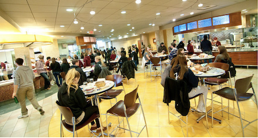
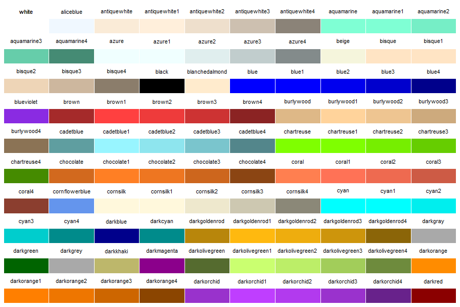

```{r setup, include=FALSE}
library(learnr)
knitr::opts_chunk$set(echo = FALSE)

commons <- read.csv("datasets/commons.csv")[c("name", "type", "days", "open", "close")]

retailers <- read.csv("datasets/retailers.csv")[c("name", "days", "open", "close")]

menu <- read.csv(file = "datasets/menu.csv", header = TRUE)

sandwich = subset(menu, type == "sandwich")
bakery = subset(menu, type == "bakery")
beverage = subset(menu, type == "beverage")
dessert  = subset(menu, type == "dessert")
entree   = subset(menu, type == "entree")
salad    = subset(menu, type == "salad")
sandwich = subset(menu, type == "sandwich")
side     = subset(menu, type == "side")

options(tutorial.storage = filesystem_storage("/srv/shiny-server/tutorials/AAA_storage", compress = TRUE))
```

## 1 ---------- Introduction
## Math Modeling

The world around us is filled with important, unanswered questions. What effect will rising sea levels have on the coastal regions of the United States? When will the world’s human population surpass 10 billion? How much will it cost to go to college in 10 years? 

The only thing one can say with certainty is that any attempt to find a solution requires the use of mathematics, most likely through the creation, application, and refinement of mathematical models. A *mathematical model* is a representation of a system or scenario that is used to gain qualitative and/ or quantitative understanding of some real-world problems and to predict future behavior.

Building a useful math model does not necessarily require advanced mathematics or significant expertise in any of the fields listed above. It does require a willingness to do some research, brainstorm, and jump right in and try something that may be out of your comfort zone. (Bliss, Fowler, & Galluzzo, 2014, p.3)

Let's get started!

In this activity, you will learn and apply mathematical modeling skills and R programming skills to create models to help people improve their work and make decisions.

## About R

Google the letter "R", what do you think you will get?  

The first result is almost always **R: The R Project for Statistical Computing**.  

R is an open-source programming language for computing, statistics, modeling, and graphical analysis. With its great reliability and versatility, R is now ranked the most popular data science tool and the sixth most popular programming language in the world.  

Top-tier companies use R. Facebook, Google, Twitter, Microsoft, Uber, Airbnb...use R to perform user behavior analysis, advertising effectiveness, data visualization, risk modeling, and much more.

The best part, it is easy to get started with R. You don't need to be a programmer. R was created to allow you to use powerful computational tools with intuitive, simple commands.  


## R Coding Space

Throughout this module, you will practice coding in the **R coding space** (shown below). This special text box allows you to communicate with R. The black texts inside are **code**, which is a sequence of **commands** to carry out certain tasks. The green texts starting with the hashtag (#) are **comments**, which are explanations for humans to understand the code. R will ignore them when you run the code.  

You will use the R coding space in several ways: 1) to study examples, 2) to complete coding exercises, 3) to code on your own from scratch. Follow the instructions below to get familiar with the R coding space.

**Study Examples**  

* Click the **Run Code** button at the top-right corner, then you will see the outputs below the R coding space. 
* You can change the code, run it again, and check how the outputs change. Try these:  

    + Change `x = -30:30` to `x = -20:40`, click Run Code again, check how the graph changes; 
    + Change `y = x ^ 2` to `y = x ^ 3`, rerun it, and see what happens;
    + Change `"deepskyblue"` to `"violet"`, rerun it, and see what you've got;   
    + Change `"My Graph"` to some title you like (make sure to enclose with parentheses), rerun and check your new title.  

* The changes you made are stored in your user account. Next time you sign in, they will still be there.  
* To restore the example code, click **Start Over** at the top-left corner.  

```{r r-coding-space, exercise = TRUE}
# ---------- EXAMPLE ----------
# create variable `x` and assign a sequence of numbers
x = -30:30
# create variable `y` and assign the squared values of variable `x`
y = x ^ 2
# plot y over x
plot(x, y, col = "deepskyblue", main = "My Graph")
```
<br>

**Coding Exercises**  

You will complete coding exercises throughout the project. The coding space below shows an example. These exercises have three components:

*Instruction*  

- The comments (e.g., "Create variable 'x'...") give you instructions on what code to write. You can write your code right below the comments.  

*Hint*  

- If you need help, click the **Hint** button at the top, a **hint window** will show up with **partial code** and additional instructions to help you complete the code (e.g., `1:60` generates a sequence from 1 to 60).  
- If you would like to copy the partial code, click the **Copy to Clipboard** button at the top-right corner of the hint window, and paste it to the coding space (right-click and paste, Control+V on PC, or Command+V on Mac).  
- The partial code contains underscores (____) to indicate blanks to fill. Make sure you remove the underscores before running the code.  

*Solution*  

- To see a sample solution, click **Next Hint** at the top of the hint window. Once you see the solution, you cannot go back to the hint.  
- Some exercises do not provide sample solutions. In that case, you can ask the teacher to check your work or compare your work with your partner's.

```{r exercise, exercise = TRUE, exercise.lines = 10}
# ---------- EXERCISE ----------
# Create variable `x` and assign a sequence of numbers 1 to 60


# Create variable `y` and assign the square roots of values in variable `x`


# Plot y over x, choose your favorite color, and create a title


```

```{r exercise-hint-1}
# ---------- EXERCISE ----------
# Create variable `x` and assign a sequence of numbers 1 to 60
# HINT: `1:60` generates a sequence from 1 to 60 
x = ______

# Create variable `y` and assign the square roots of values in variable `x`
# HINT: use the `sqrt()` function
y = ______

# Plot y over x, choose your favorite color, and create a title.
# HINT: x for x-axis, y for y-axis
plot(_____, _____, col = "______", main = "______")
```

```{r exercise-solution}
# ---------- EXERCISE ----------
# Create variable `x` and assign a sequence of numbers 1 to 60
x = 1:60

# Create variable `y` and assign the square roots of values in variable `x`
y = sqrt(x)

# Plot y over x, choose your favorite color, and create a title
plot(x, y, col = "forestgreen", main = "Square Root")

```
<br>

**From Scratch**

As you develop more skills, you can start to write your own code from scratch. 
You can use **My Code** on the next page to experiment ideas, combine code snippets, and run longer code.

## My Code

<center>
> Talk is cheap.
> Show me the code.          

----- *Linus Torvalds*, Creator of the Linux kernel
</center>

```{r my-coding-space, exercise = TRUE, exercise.lines = 30}

```

Your code is automatically saved in your user account. Next time you sign in, it will be there. However, it is a good idea to copy and paste your code to another place (e.g., Google doc) for backup and version control (if you have multiple versions). 

## 2 ---------- The Challenge
## Overloaded Counselors

Counselors at colleges are responsible for improving students' well-being. They help students learn practical life skills necessary to manage their busy and often stressful college life.  

A challenge facing many counselors is the increasing demand. While enrollment increases year after year, the university has not expanded the counseling team to accommodate for the increasing demand. Therefore, more often than not the advice is too general, not specific for each student's needs.

For instance, many students are concerned about their expenses. One question students often ask is whether they should sign up for the meal plans offered by the dining departments. With meal plans, you make one payment at the beginning of a semester and have unlimited (or by swipe) access to designated dining locations. Without a meal plan, you can still visit the dining hall and pay per meal, or go to other retail dining locations and pay as you go or, yet, cook on your own (if you have a kitchen, skills, and... time). 

To simplify the question, we will focus on two options for now:  

Between **Meal Plan** and **Pay As You Go** (that is, going to retail dining locations), how should counselors give advice to students (assuming the counselors are not biased or influenced by the college administration)?  

There are a lot of factors to consider: convenience, food variety, special diet, etc. But one factor commonly considered is costs. If someone has a tight budget, they may want to choose the less expensive option. For others with more budgetary flexibility, they do not want to overpay either. So how do the two ways of dining compare in terms of costs? That's the question most students would have in mind. 

In this lesson, let's tackle this question together. In the end, you will learn how to define a modeling problem, create solutions, design algorithms, and write R code so that college counselors can run the model for individual students' needs and efficiently and accurately help each student.

Discuss the following questions with your partners:

<div class="alert alert-info">
**1.** What factors do counselors need to consider to provide sound advice?  
**2.** How can counselors provide more specific advice to students according to their particular situations?  
**3.** How can counselors work in a more efficient way, helping more students within the same amount of time?
</div>

Work on a whiteboard, a large notepad, or a document on your computer. Jot down as many ideas as you can and sort them into categories.

## Dining at UMass

Let's consider the particular case of the University of Massachusetts Amherst (UMass). UMass has four dining commons near the residential areas offering award-winning dining experience. There are also over forty retailers on and around campus. You can find almost all kinds of foods you may want.  

On the next two pages, we outline some essential information about meal plans (for dining commons) and pay as you go (for retailers) and some links for you to find additional information.  

While reading about the two options, think about the following questions. Discuss with your partners and jot down your ideas.

- What matters to college students when it comes to dining? 
- Does it make sense to compare the costs of two options? 
- What assumptions do you have to make to justify that it is a fair comparison?




## Dining Commons

UMass Dining offers many meal plans. For our purpose here, we will just consider two popular options:

**Unlimited+**  *$3,269 / Semester*  or  **Unlimited**  *$3,067 / Semester*

- Unlimited Access to all four campus dining commons!
- Includes $500/\$250 (Unlimited+ / Unlimited)) Dining Dollars for use in any on-campus retail dining location
- Open to both on-campus & off-campus students
- 15 Guest Meals included

Note that students without a meal plan still can eat at the dining commons with [cash prices](https://www.umass.edu/events/dining-watermelon-special){target="_blank"}:   

- Breakfast: \$8.50  
- Lunch: \$11.50  
- Dinner: \$14.50

**Menu**
Wondering what food you can get at the dining commons? Check out one of the menus: [Berkshire menu](http://umassdining.com/locations-menus/berkshire/menu){target="_blank"}.  

**Hours of Operation**  
All dining commons are open continuously from breakfast through dinner, 7 days a week and Worcester and Berkshire offer late night options Sunday through Thursday. Breakfast on the Run and Grab ‘n Go lunch options are available during the week at All Dining Commons when you don’t have the time to sit and eat. During Exam Periods evening hours are extended. ( [Meal Plan FAQ](http://umassdining.com/faq){target="_blank"} )

Below is a summary of the hours of operation.
```{r}
commons
```

**Schedule of operations**  
All semester meal plans follow the residence halls schedule of operations. Fall and spring semester meal plans begin on move-in day for multi-year students. Fall semester meal plans end the day after move-out day. Spring semester meal plans end the Sunday after Commencement. Meals do not carry forward from one semester to another; however, Dining Dollars carry forward from Fall to Spring semesters only.( [Meal Plan FAQ](http://umassdining.com/faq){target="_blank"} )  

- Spring move-in:  January 19  
- Spring move-out: May 9  
- Spring break: March 9 - March 17  
[Residence Hall Openings and Closings](https://www.umass.edu/living/assign/hall-open-close){target="_blank"}

## Retailers

There are over 40 retailers on and around campus. For our purpose here, let's just consider the [retailers located at the Campus Center building](http://umassdining.com/locations-menus/campus-center){target="_blank"}, conveniently located at the very center of the university:  

- *People's Organic Coffee*: Fair Trade coffees and more 
- *U-Pub*: pool, big screen, outdoor seating...  
- *Harvest Market*: hot bar, salad bar, yogurt bar, fresh bagels
- *Tavola*: house made pizzas, hummus bowls, pasta....
- *Yum! Bakery*: homemade cookies, pastries, cakes
- *Green Fields*: healthy, sustainable and delicious salad
- *Tamales*: authentic Mexican
- *Wasabi*: sushi, rolls
- *Deli Delish*: grinders, rolls and hot sandwiches
- *Star Ginger*: authentic Asian
- *The Grill*: burger or grilled sandwich
- *Bamboo at Chef’s Table*: Authentic Dim Sum
- *Paciugo*: Italian Gelato

These retailers made their menus with prices available online. Here are a few of them for you to check out. In the next activity, we will use R to help us understand the retailers' prices and sales, which are critical for building our mathematical model.   

- [People's Organic Coffee menu](http://umassdining.com/menu/french-meadow-caf%C3%A9){target="_blank"}  
- [Tavola menu](http://umassdining.com/menu/tavola){target="_blank"}  
- [Star Ginger menu](http://umassdining.com/menu/star-ginger-blue-wall-menu){target="_blank"}  

**Hours of Operation**
```{r}
retailers
```


## Assumptions

Have you thought about how these two dining options can be compared on a fair basis?  

Some assumptions for our case can be:  
<br>
**1. Cash flow is not a concern**  
Students have enough funds to pay for meal plans upfront ($3269 or \$3067).

**2. Retailers' hours of operation is not a concern**  
Although retailers have different hours of operations, the student will always have at least a couple options where to have a meal.  
   
**3. Retailers' locations are convenient**  
Retailers are spread around campus in a way that visiting one of them is equally or more convenient than going to one of the dining commons.
   
**4. Ignore dining dollars and guest meals**  
At least initially, we can ignore dining dollars and guest meals, a perk offered with the meal plans. 

## 3 ---------- Retailers' Menu

## The Data
We prepared a data set called `menu` to store some information of the food sold by the retailers at the campus center. And to save us some time, we already loaded the data to R's memory. 

It's super easy to access data in R's memory. Just type its name and run. In the R coding space below, click Run Code and you will see a table of **rows** and **columns**. This table-like data structure is called **data frame**.  

Each row is an **observation**, a food item in this case (e.g., fountain drink). Each column is an **attribute** (sometimes called variables) of the observation. The **header** of the table shows the attributes. Below are descriptions of these attributes: 

- `name`: name of the item, e.g., "fantastic roll", "breakfast bagel"
- `type`: beverage, bakery, sandwich, etc.
- `retailer`: shortened names of the retailers, e.g., "grill" for "The Grill"
- `size`: L(large), S(small), N(served in one size only)
- `price`: the price of the item in US dollars
- `sales`: average number of items sold in a day

```{r menu, exercise = TRUE}
# See the `menu` data
menu
```
<br>

The data set is sorted by retailer, type, name, and size in alphabetical order. 

Browse the data (click <font color="skyblue">Next</font> or the page numbers to see more items) and see if you can answer the following questions below.

1. What is the price of a small veggie burger sold at The Grill?  
2. Does Green Fields sell anything other than salads?  
3. What beverages are sold at the People's Organic Coffee?  
4. Are all the fountain drinks priced the same?

## A Little Summary

There are a lot of items in the `menu` data set, 216 rows!  
Let's use the `summary()` function to summarize the data. Run the code below. Carefully read the output and see if you can answer the following questions:  

1. What types of food do the retailers offer?
2. Which retailers offer more than 50 items?
3. How many items have two different sizes?
4. What is the average price of all items?
5. What is the highest sales among all items? 

```{r summary, exercise = TRUE}
summary(menu)
```

## Just the Prices
We are mostly concerned about the prices of the items sold by retailers. To just examine the `price` column, use a dollar sign `$` to joint the data frame and the column name as `menu$price`.  
Run the code below and you will see all the prices organized in lines(e.g., [1], [12]). The numbers in brackets at the left side of each line indicate the positions of the first element on that line in the entire list. For example, the second line has [12] on its left. That means the first number `7.00` is the 12th element in the entire list.

```{r price-access, exercise = TRUE}
# Extract the `price` column from `menu` data frame
menu$price
```

## Price: Histograms  

It is hard to see any pattern with all these numbers. We need some visualizations to help us!    

Let's use the `hist()` function to create a histogram of the prices. Run the code below and you will get a histogram.  

- What patterns do you see?  
- How much would students spend on a regular meal? Can you tell?  

```{r hist, exercise = TRUE}
hist(menu$price)
```
<br>

Wanna dress up our plots? Let's add some color to the bars. Run the code below and see how you like it. Try your favorite color.  

```{r hist-col, exercise = TRUE}
hist(menu$price, col = "Coral")
```


<br>

Need a better title and some labels? Sure thing! Assign your title to the `main` argument and your x-axis label to the `xlab` argument. Feel free to modify the code below to make it your own.

```{r hist-title, exercise = TRUE}
hist(menu$price,
     col = "Coral",
     main = "Histogram of prices at the Campus Center",
     xlab = "Price in US dollars ($)")
```

## Price: Boxplots  

We can also use the `boxplot()` function to create boxplots of the price data. Run the code below. What information can you get from the boxplot? 
```{r boxplot, exercise = TRUE}
boxplot(menu$price)
```
<br>

Well, you probably notice that the boxplot for all the prices was not very useful. We want to know the price distribution for each food type. To do that, we can use the tilde symbol `~` to indicate the grouping variable.
```{r boxplot-grouping, exercise = TRUE}
boxplot(menu$price ~ menu$type)
```
<br>

To make it more appealing, let's add some color. Use the `col` argument and use the `rainbow()` to generate 7 rainbow colors. 
```{r boxplot-color, exercise = TRUE}
boxplot(menu$price ~ menu$type,
        col = rainbow(7))
```

## Prices & Sales

You may wonder about how do prices and sales of the items relate. Let's create a scatterplot using the `plot()` function. Assign `menu$price` to the x-axis and `menu$sales` to the y-axis. Run the code below. Do you see any pattern?

```{r plot, exercise = TRUE}
plot(x = menu$price, y = menu$sales)
```

## Just the Sandwiches

What would a typical student have for a meal? Say for lunch, maybe grab a sandwich?   

Let's create a subset for just sandwiches using the `subset()` function. The first argument should be the main data set `menu`. The second argument says `type` is equal to `"sandwich"` (`==` means "equal to"). Run the code below and check the output. It is a subset of the `menu` data that only has sandwiches.

```{r subset, exercise = TRUE}
# Create a subset of `menu` with only sandwiches
subset(menu, type == "sandwich")
```
<br>

Next, we can create a variable called `sandwich` and assign the subset to it. This way, we can just type `sandwich` to access the subset in the future. Use the assignment operator `=` to assign the object on its right to the variable on its left. 
```{r subset-assign, exercise = TRUE}
# Create a variable `sandwich` and assign the sandwich subset to it
sandwich = subset(menu, type == "sandwich")
# Take a look of the subset
sandwich
```
<br>

Try it for yourself to create subsets for other food types (beverage, dessert, entree, salad, sandwich, and side), create histograms for their prices, and think about how much students may spend on a meal.
```{r subset-other, exercise = TRUE, exercise.lines = 8}
# Create subsets for all the food types
bakery   =
beverage = 
dessert  = 
entree   = 
salad    = 
sandwich = 
side     = 
```

```{r subset-other-hint}
# Create a subset for certain food type
# HINT: specify the type of food in the `subset()` function 
bakery   = subset(menu, type == "______")
beverage = subset(menu, type == "______")
dessert  = subset(menu, type == "______")
entree   = subset(menu, type == "______")
salad    = subset(menu, type == "______")
sandwich = subset(menu, type == "______")
side     = subset(menu, type == "______")
```

```{r subset-other-solution}
bakery   = subset(menu, type == "bakery")
beverage = subset(menu, type == "beverage")
dessert  = subset(menu, type == "dessert")
entree   = subset(menu, type == "entree")
salad    = subset(menu, type == "salad")
sandwich = subset(menu, type == "sandwich")
side     = subset(menu, type == "side")
```

## Typically...

Now we've got all the subsets. What do students typically spend on each type?  
 
Take sandwiches for an example. We can visualize their prices with `hist()` and `boxplot()`. What information can you get from the plots?  
```{r sandwich-info, exercise = TRUE}
# Create a histogram for sandwich prices
hist(sandwich$price)
# Create a boxplot for sandwich prices
boxplot(sandwich$price)
```
<br>

A lot of sandwiches are priced at $7 or \$8. Is it reasonable to assume that a typical student would buy them? Let's check these prices against the sales. What can you tell from the scatter plot?
```{r plot-sandwich, exercise = TRUE}
plot(sandwich$price, sandwich$sales)
```
<br>

Now you probably have ideas about what typical students would spend on a sandwich. Here are some handy statistical functions for you: 
```{r stats, exercise = TRUE}
# The cheapest sandwich price
min(sandwich$price)
# The most expensive sandwich price
max(sandwich$price)
# The average sandwich price
mean(sandwich$price)
# The median sandwich price
median(sandwich$price)
# The standard deviation of sandwich prices
sd(sandwich$price)
```
<br>

You can explore another food type with the steps shown above to help you determine what typical students would spend on certain type of food.

## Cost of a Meal

Students might grab a beverage along with the sandwich for lunch. Can we estimate the cost of a whole meal (beverage & sandwich)? Sure thing! Just use the addition operator `+` to add up the costs.  

We can add up specific values, such as an $8.00 Blue Wall Club sandwich and a \$1.00 fountain drink.
```{r blue-fountain, exercise = TRUE}
# Total cost of a "blue wall club" sandwich and a "fountain drink"
8.00 + 1.00
```
<br>

We can also add up the results of some statistical functions to capture the whole picture. For example, the average sandwich price and the average beverage price. 
```{r mean-add, exercise = TRUE}
# Average sandwich price and average beverage price
mean(sandwich$price) + mean(beverage$price)
```
<br>

Maybe you think using median is more reasonable for sandwiches because its price has a skewed distribution. And most students go with the cheapest beverage based on your analysis of the sales. 
```{r median-min, exercise = TRUE}
# Median sandwich price and median beverage price
median(sandwich$price) + min(beverage$price)
```
<br>

In the R coding space below, estimate the costs of breakfast, lunch, and dinner using statistical functions (`min()`, `max()`, `mean()`, `median()`, `sd()`) and the addition operator `+`.

```{r meal-cost, exercise = TRUE, exercise.lines = 10}
# Estimate the cost of breakfast


# Estimate the cost of lunch


# Estimate the cost of dinner


```

## 4 --------------------

## Algorithm & Code

Now, let's think clearly what results the model should produce. Basically, the results should be:

<div class="alert alert-info">
What option is less expensive?
<br>
How much is the difference between the two options?
</div>

Let's pretend that we already know which meal plan to choose and how much the total cost of pay-as-you-go would be. We can write an R code to represent this end result.

- Run the code and check the output.  
- Change 3269 on the first line to 3067 (to reflect a different meal plan) and run the code again. See the new outputs?  
- To restore the original code, click **Start Over** on the top-left corner.  

```{r output, exercise = TRUE}
# Choose which meal plan to consider
meal_plan = 3269

# Estimate the cost of pay-as-you-go
pay_go = 3000

# Compute the difference between the two
difference = abs(meal_plan - pay_go)

# Report the results
paste("Selected meal plan:", meal_plan)
paste("Pay as you go:", pay_go)
paste("Difference between the two:", difference)
```
<br>

In the following pages, we will recreate this code snippet together, step by step. You will learn the programming concepts behind it and be able to customize it to your liking.

## Inputs - meal plan

First, let's create a variable called `meal_plan` and use the assignment operator `=` to assign a numeric value to it (3269, the cost of the Unlimited+ plan). Variable name on the left and the value on the right.  

In programming, ***variable*** is a symbolic name that is used to keep track of a value that can change while a program is running. That means `meal_plan` will hold the value `3269` for now.

If you run the code, you won't see any output. It is simply stored in R's memory, which is invisible to us.  
```{r create, exercise = TRUE}
# create a variable called 'meal_plan' and assign a value to it
meal_plan = 3269 
```
<br>

To see the value we assigned, simply type the name of the variable.  

- Run the code below and check out the output.   
- Change the value to some other value.  
- Rerun the code and check if the output changes correspondingly.

```{r create-view, exercise = TRUE}
# Create a variable called 'meal_plan' and assign a value to it
meal_plan = 3269  

# View the value assigned to the variable 'meal_plan'
meal_plan         

```

## An interactive report

For viewers to know what this number is, let's add a text that says "Selected meal plan:".  

Text is also called ***string*** in R. To let R know something is a string, we need to put the string it between quotation marks.  

- Run the code and check the outputs.  
- Change the text to something you like (don't forget the quotation marks)
- Rerun the code and check the outputs.

```{r create-view-note, exercise = TRUE}
# Create a variable called 'meal_plan' and assign a value to it
meal_plan = 3269  

# Create a note for the output
"Meal plan price: "

# View the value assigned to the variable 'meal_plan'
meal_plan

```
<br>

Now, let's put the text and the number together to make a short report like this **Selected meal plan: 3269**. To do that, let's use an R function called `paste()`.   

To use the `paste()` function, simply type its name `paste` and immediately follow with argument values (`"Selected meal plan:"` and `meal_plan`) separated by commas `,` and enclosed in parentheses `()`.

- Run the code and check the outputs.  
- Change the value assigned to `meal_plan` and modify the text `"Selected meal plan:"` to something you like.
- Rerun the code and check if the new outputs reflect the changes you made.

```{r create-report, exercise = TRUE}
# Create a variable called 'meal_plan' and assign 3269 to it
meal_plan = 3269  
# Create a report for the output
paste("Selected meal plan:", meal_plan)
```

## Inputs - Pay as you go

Now you know how to create a variable, assign a value to it, and generate an interactive report. Try it yourself:  

1. Create the variable `pay_go` (a shorter name to represent pay-as-you-go) and assigned a dummy value 3000 to it.  
2. Generate a report that says "Pay as you go: 3000".

- Add to the existing code below.
- Run the new code and check the output.
- If you need help, click the **Hint** button on the top.
- Done? Ask the teacher to check your work.

```{r pay_go, exercise = TRUE, exercise.lines = 12}
# Choose which meal plan to consider
meal_plan = 3269

# Estimate the cost of pay-as-you-go


# Report the cost of selected meal plan
paste("Selected meal plan:", meal_plan)

# Report the cost of pay-as-you-go


```

```{r pay_go-hint}
# Choose which meal plan to consider
meal_plan = 3269

# Estimate the cost of pay-as-you-go
# Assign a dummy value to variable 'pay_go'
pay_go = ____  

# Report the cost of selected meal plan
paste("Selected meal plan:", meal_plan)

# Report the cost of pay-as-you-go
# Insert the variable name 'pay_go' in the paste() function
paste("Pay as you go:", ______)
```

## Compute the Difference

Now we have both inputs: costs of a meal plan and pay-as-you-go. Let's compute the difference. R has many arithmetic operators (`+`, `-`, `*`, `/`, `^`, and more). Here, let's use the subtraction operator `-`.

```{r subtraction, exercise = TRUE}
# Choose which meal plan to consider
meal_plan = 3269

# Estimate the cost of pay-as-you-go
pay_go = 3000

# Compute the difference between the two
meal_plan - pay_go

```
<br>

If you assign a greater value, say $4000, to `pay_go`, R will return a negative value. Well, we want to always report a positive value. To do that, we can use an R function called `abs`.

Type its name and a pair of parentheses `abs()` and place the expression `meal_plan - pay_as_you_go` inside the parentheses.

```{r abs, exercise = TRUE}
# Choose which meal plan to consider
meal_plan = 3269

# Estimate the cost of pay-as-you-go
pay_go = 3000

# Compute the difference between the two
abs(meal_plan - pay_go)

```
<br>

Create a variable `difference` and assign the result of the `abs()` function applied to the expression `meal_plan - pay_go`.

```{r step4_5, exercise = TRUE}
# Choose which meal plan to consider
meal_plan = 3269

# Estimate the cost of pay-as-you-go
pay_go = 3000

# Compute the difference between the two
difference = abs(meal_plan - pay_go)

# Reporting the results
paste("Selected meal plan:", meal_plan)
paste("Pay as you go:", pay_go)
paste("Difference between the two:", difference)

```

## Customize It

Below you will find the entire script with all the pieces put together.   
It's yours, and you can change variables names and values, outputs, and comments to your liking.  

In **R**, you can name variables using a single letter, multiple letters, and with additional numbers, underscores, and dots (you can't start with a number though, or use some special symbols). For example, you can use a shorter name to represent the meal plan cost, such as `mp` or use a longer name like `meal_plan_cost_semester`.


```{r full-code, exercise = TRUE, exercise.cap = "Full Code", exercise.lines = 22}
#-----------------------------------------------------------
# R Code to report the difference between two dining options
#-----------------------------------------------------------
# 1. Choose which meal plan to consider:
meal_plan = 3269

# 2. Estimate the cost of pay-as-you-go:
pay_go = 3150

# 4. Compute the difference between the two costs (in absolute $):
difference = abs(meal_plan - pay_go)

# Report the results
paste("Selected meal plan:", meal_plan)
paste("Pay as you go:", pay_go)
paste("Difference between the two:", difference)
```

## 5 --------------------

## A Rough Estimate

The unknown input of our model is the cost of pay-as-you-go over a semester (the `pay_go` variable). Let's ***assume*** that students eat more or less the same way each day, so we can roughly estimate the total cost based on a daily cost and the number of days in a semester.  

Let's update the pay_go variable with an ***arithmetic expression***. In the code snippet below, we estimated \$5 for breakfast, \$8 for lunch, and \$10 for dinner. And there are 7 days in a week and about 15 weeks in a semester.  

R has all the ***arithmetic operators*** you will need: `+`, `-`, `*`, `/`, `^` (for exponents).  

**PEMDAS** applies in R as well: **P**arentheses first, followed by **E**xponents, **M**ultiply or **D**ivide, and **A**ddition and **S**ubtraction.

- Run the code and check the output.
- Change the estimates to what you have in mind (perhaps a $7 breakfast works better for you).
- Rerun the code and check the new output.

```{r pay-go, exercise = TRUE}
pay_go = (5 + 8 + 10) * (7 * 15)

paste("Pay as you go:", pay_go)

```

## Daily & Days

The daily cost and number of days are just rough estimates. They will change a lot when we investigate further. Let's make it easier to change these estimates later.  
In the code snippet below, we created variables `daily` and `days` to hold their estimates, and then we created an ***expression*** `daily * days` and assigned the expression to the variable `pay_go`. R will first evaluate the expression with the current values of `daily` ($23) and `days` (105 days) and then assign the result (\$2415) to `pay_go`.  

- Run the code and check the output.
- Change the estimates as you like.
- Rerun the code and check the new output.

```{r daily-days, exercise = TRUE}
# Estimate the daily cost adding dummy values for each meal:
daily = 5 + 8 + 10

# Estimate the number of days in one academic semester:
days = 7 * 15

# Estimate the cost of pay-as-you-go, by the end of semester:
pay_go = daily * days

# Report the results:
paste("Pay as you go:", pay_go)

```
<br>

The new variables also allow us to add details to the report. In the snippet below, we added reports for daily cost and the number of days estimated.  

- Run the code and check the output.
- Change the estimates as you like, rerun the code and check the output.

```{r daily-days-report, exercise = TRUE}
daily = 5 + 8 + 10
days = 7 * 15
pay_go = daily * days

paste("Daily:", daily)
paste("Number of days:", days)
paste("Pay as you go:", pay_go)

```

## Breakfast, lunch, & dinner

You may wonder whether the three values (\$5, \$8, \$10) assigned to `daily` should also be turned into variables. That will make it clearer what they are and easier to update the estimates later. You are on the right track!  

Now you know how to assign an expression to a variable. Try it yourself to create variables `breakfast`, `lunch`, and `dinner`, add them up and assign to the variable `daily`.   

- Complete the code below.
- Run the code and check the output.
- Click Hint if you need help.
- Done? Ask the teacher to check your work.

```{r three-meals, exercise = TRUE}
# Create variable 'breakfast' and assign a value to it 
breakfast = 5

# Create variable `lunch` and assign a value to it


# Create variable `dinner` and assign a value to it


# Assign the sum of 'breakfast', 'lunch', 'dinner'
# to variable 'daily'  
daily = 
  
# Report
paste("Pay-as-you-go daily cost:", daily)

```

```{r three-meals-hint}
breakfast = 5
# assign a value to variable 'lunch'
lunch = ___ 
# assign a value to variable 'dinner'
dinner = ___ 
# also add 'lunch' and 'dinner' to the expression
daily = breakfast + _____ + _____

paste("Pay-as-you-go daily cost:", daily)
```

## Snacks?

Something important is missing! The students need snacks to keep their energy up. 
In the R coding space below, incorporate snacks to your estimate of the daily cost of pay-as-you-go. Consider creating a variable for this new item to make it easy to update its estimate later.

- Add code to the existing code below.
- Run the new code and check the output.
- Click **Hint** if you need help.
- Done? Ask the teacher to check your work.

```{r snack, exercise = TRUE}
breakfast = 5
lunch = 8
dinner = 10
daily = breakfast + lunch + dinner
paste("Daily cost:", daily)

```

```{r snack-hint}
breakfast = 5
lunch = 8
dinner = 10
# create a new variable called 'snack' and assign 2 to it
snack = _____
# add the new variable 'snack' to the expression assigned to 'daily'
daily = breakfast + lunch + dinner + ______ 
paste("Daily cost:", daily)
```

## A Better Model

Recall the *main script* we wrote earlier (see below). The number assigned to `pay_go` was just a dummy value.

```{r echo=TRUE, eval=FALSE}
# Choose which meal plan to consider:
meal_plan = 3269
# Estimate the cost of pay as you go:
pay_go = 3150 
# Compute the difference (in absolute $):
difference = abs(meal_plan - pay_go)

# Report the difference:
paste("Selected meal plan:", meal_plan)
paste("Pay as you go:", pay_go)
paste("The difference is", difference, "dollars.")
```
<br>

Now, let's add the code snippet to the main script.  

The *pay-as-you-go* snippet
```{r echo=TRUE, eval=FALSE}
# Estimating total cost of pay-as-you-go
breakfast = 5
lunch = 8
dinner = 10
snack = 2
daily = breakfast + lunch + dinner + snack
days  = 15 * 7
pay_go = daily * days

# Reporting results
paste("Pay-as-you-go daily cost:", daily)
paste("Number of days:", days)
paste("Pay-as-you-go total cost:", pay_go)
```
<br>

In the code below, we have replaced step 2 "# Estimate the cost of pay as you go:" in the main script with the estimating part of the *pay as you go* snippet. Can you add the two additional report lines below to the script?

```{r echo=TRUE, eval=FALSE}
paste("Pay-as-you-go daily cost:", daily)
paste("Number of days:", days)
```
<br>

```{r report-new, exercise = TRUE, exercise.lines = 25}
# Choose which meal plan to consider:
meal_plan = 3269

# ---------- NEW ----------
# Estimating the cost of pay-as-you-go
breakfast = 5
lunch = 8
dinner = 10
snack = 2
daily = breakfast + lunch + dinner + snack
days  = 15 * 7
pay_go = daily * days
# -------------------------

# Compute the difference between the two
difference = abs(meal_plan - pay_go)

# Report the results
paste("Selected meal plan:", meal_plan)
paste("Pay as you go:", pay_go)
paste("Difference between the two:", difference)
```

## Use Data

How about we use the retailers' menu data to estimate the costs of breakfast, lunch, dinner, and snack?  

In *Activity 3 - Cost of a Meal*, we used statistical functions and arithmetic operators to "compose a meal" and estimate its cost. For example, we estimated the cost of lunch as the sum of the average sandwich price and the average beverage price: 
```{r mean-add-review, exercise = TRUE}
# Average sandwich price and average beverage price
mean(sandwich$price) + mean(beverage$price)
```
<br>

Prior to this point, we assigned $8 to the `lunch` variable. Let's replace this number with the expression above (see the code below). So when the counselors work with their students, they can provide more accurate estimates based on the students' situations. For instance, very healthy eaters may just want a salad for lunch while athletes may add sides for more calories.
```{r use-data-lunch, exercise = TRUE}
# Assign 'lunch' with the sum of average sandwich price and average beverage price
lunch = mean(sandwich$price) + mean(beverage$price)

# Report the cost of lunch
paste("Cost of lunch:", lunch)

# Round up the estimate using the `round()` function
paste("Cost of lunch:", round(lunch, digits = 2))

```
<br>

In the coding space below, compose your meals and estimate their costs using statistical functions and the addition operator `+`, and assign the estimates to the `breakfast`, `lunch`, `dinner`, and `snack` variables. If you have done the first part in *Activity 3 - Cost of a Meal*, copy and paste your code here and go from there.
```{r use-data-variables, exercise = TRUE, exercise.lines = 8}
# Estimate the cost of breakfast

# Estimate the cost of lunch

# Estimate the cost of dinner

# Estimate the cost of snack

```
<br>

Once you have the new data-based estimates, you can use them to replace the old static estimates. Also, add four new reports for these estimates (since they are computed based on data).
```{r replace-estimate, exercise = TRUE, exercise.lines = 35}
# Choose which meal plan to consider:
meal_plan = 3269

# Estimating the cost of pay-as-you-go
# ---------- OLD ----------
# Replace the estimates below with your new ones
breakfast = 5
lunch = 8
dinner = 10
snack = 2
# -------------------------

daily = breakfast + lunch + dinner + snack
days  = 15 * 7
pay_go = daily * days

# Compute the difference between the two
difference = abs(meal_plan - pay_go)

# Report the results
# ---------- ADD REPORTS ----------
# Report the cost of breakfast

# Report the cost of lunch

# Report the cost of dinner

# Report the cost of snack

# ---------------------------------
paste("Selected meal plan:", meal_plan)
paste("Pay as you go:", pay_go)
paste("Difference between the two:", difference)

```


## 6 ---------- Off-Campus Days

## Question the assumption

To build the basic model, we have made a number of assumptions:  

- Four meals a day: breakfast, lunch, dinner, and snack;
- Students eat more or less the same way each day;
- Students are on campus every day.

Discuss the following questions with your partners and take notes of your ideas.

- Are these assumptions reasonable?  
- Which assumptions are the least realistic?  
- How would improve your model to address the problematic assumptions?  

In this activity, we will address one problematic assumption together, and investigate how the underlying factor may affect the outputs of our model.

## Off-Campus Days

You may have considered that some students' families are close to the university. These students can eat with their families *for free* during the weekends.  

- If they opted to pay as you go, that means they would save money by eating with families.
- If they purchased an unlimited meal plan, that means they would waste some money because the dining department wouldn't refund for the meals skipped by them.   

Well, that's a game changer. Let's investigate how the off-campus (eat for free) days impact how the two dining options compare.  

First, let's create a variable called `off_campus` and assign a value (e.g., 10 days) to it. Then, reassign the variable `days` with the number of days in a semester (7 days * 15 weeks per semester) subtracted by the `off_campus` days (yes, you can mix values and variables in one expression).  

- Try it yourself to write the code from scratch  
- Click **Hint** if you need help

```{r off-campus, exercise = TRUE, exercise.lines = 6}
# Create variable 'off_campus' and assign a value to it


# Assign '7 * 15 - off_campus' to variable 'days'


```

```{r off-campus-hint}
# create variable 'off_campus' and assign a value to it
off_campus = _____

# assign '7 * 15 - off_campus' to variable 'days'
days = 7 * 15 - _____

```

```{r off-campus-solution}
# ----- A SAMPLE SOLUTION -----
# create variable 'off_campus' and assign a value to it
off_campus = 10

# assign '7 * 15 - off_campus' to variable 'days'
days = 7 * 15 - off_campus

```

## Impact on Decision

How does the number of off-campus days affect the comparison result?

Now, let's replace the existing code for `days`:

```{r echo = TRUE, eval = FALSE}
days = 7 * 15

```
<br>

with the new code snippet you just wrote:

```{r echo = TRUE, eval = FALSE}
off_campus = 10
days = 7 * 15 - off_campus

```
<br>

In the R coding space below:

- Update the code with the new snippet.
- Click Hint if you need help.
- Then you are ready to investigate the question:
    - assign a different value to `off_campus`, rerun the code, and record the results.
    - repeat the above step several times and see what you can find out. 

```{r days-replace, exercise = TRUE, exercise.lines = 26}
# Choose which meal plan to consider
meal_plan = 3269
# Estimate the cost of pay-as-you-go
breakfast = 8.5
lunch = 11.5
dinner = 14.5
snack = 2.5
daily = breakfast + lunch + dinner + snack

# ----- OLD SNIPPET ----------
# Determine the number of days 
days = 7 * 15
# ----------------------------

# Compute the cost of pay as you go
pay_go = daily * days
# Compute the difference between the two
difference = abs(meal_plan - pay_go)
# Report the results
paste("Selected meal plan:", meal_plan)
paste("Daily cost:", daily)
paste("Number of days:", days)
paste("Pay as you go:", pay_go)
paste("Difference between the two:", difference)

```

```{r days-replace-hint}
# Choose which meal plan to consider
meal_plan = 3269
# Estimate the cost of pay-as-you-go
breakfast = 8.5
lunch = 11.5
dinner = 14.5
snack = 2.5
daily = breakfast + lunch + dinner + snack

# ----- NEW SNIPPET ----------
# Determine the number of days
off_campus = 10
days = 7 * 15 - off_campus
# ----------------------------

# Compute the cost of pay as you go
pay_go = daily * days
# Compute the difference between the two
difference = abs(meal_plan - pay_go)
# Report the results
paste("Selected meal plan:", meal_plan)
paste("Daily cost:", daily)
paste("Number of days:", days)
paste("Pay as you go:", pay_go)
paste("Difference between the two:", difference)

```

## Rapid Computation

You probably have tried several inputs and felt that it's a little bit tedious to do it over and over again.  

Let's make our life easier by creating a list of values you want to try, say 0 through 30 days for `off_campus.v` (to distinguish it from `off_campus` for a single value). This list is called ***vector*** in R programming (not to be confused with vectors in geometry or physics). The items in the vector are called ***elements***.  

To create a vector that goes from 0 to 30, we can use the colon operator `:`, place the start number on the left and the end number on the right: `0:30`. Then assign this vector to the variable `off_campus.v = 0:30`.  

- Run the code below and check what the vector looks like.  
- Try different sets of start and end numbers (e.g., `5:15`).  
- Rerun the code and check the output.  

```{r off-campus-vector, exercise = TRUE}
# Assign a vector of numbers 0 through 30 to variable 'off_campus'
off_campus.v = 0:30

# View the values of variable 'off_campus'
off_campus.v

```
<br>

Now that `off_campus.v` is a list of numbers, you may wonder what happens to the next command `days.v = 7 * 15 - off_campus.v`. Will it create a list of numbers as well? You guessed it right! R performs the subtraction for each of the elements in the vector (0, 1, 2...30) and return the corresponding results as a list (105, 104,..., 75).  

- Run the code below and check the outputs. Do the numbers in the two lists correspond to each other?  
- Change the sequence 0:30 a bit, rerun the code, and check the outputs. 

```{r days-vector, exercise = TRUE}
# Assign a vector of numbers 0 through 30 to variable 'off_campus'
off_campus.v = 0:30
# Determine the number of days for pay as you go
days.v = 7 * 15 - off_campus.v

# View the two vectors
off_campus.v
days.v

```

## Frame the Data

You may notice that it is not easy to check the corresponding elements in `off_campus.v` and `days.v`, because different numbers of digits make their positions off each other.  

To make it easier to align the corresponding elements, let's use the `data.frame()` function to set the two vectors as two columns. Just type `off_campus.v` and `days.v` inside its parentheses, separated by a comma.  

- Run the code below and check the columns generated.

```{r data-frame-1, exercise = TRUE}
# Assign a vector of numbers 0 through 30 to variable 'off_campus'
off_campus.v = 0:30
# Determine the number of days for pay as you go
days.v = 7 * 15 - off_campus.v

# Set 'off_campus' and 'days' as two columns
data.frame(off_campus.v, days.v)

```
<br>

In the same way, we can add `pay_go.v`, a series of pay-as-you-go costs based on off-campus days, to the data frame. To make it simple, we will set $37 as the daily cost (instead of carrying over the code snippet for `daily`).

- Add `pay_go.v` as the third argument in the `data.frame()` function.  
- Run the code and check the outputs. Do you see anything interesting?

```{r data-frame-pay-go, exercise = TRUE}
# Assign a vector of numbers 0 through 30 to variable 'off_campus'
off_campus.v = 0:30
# Determine the number of days for pay as you go
days.v = 7 * 15 - off_campus.v
# Compute the cost of pay as you go
pay_go.v = 37 * days.v

# Add 'pay_go' as the third columns
data.frame(off_campus.v, days.v, ______)

```

```{r data-frame-pay-go-solution}
# Assign a vector of numbers 0 through 30 to variable 'off_campus'
off_campus.v = 0:30
# Determine the number of days for pay as you go
days.v = 7 * 15 - off_campus.v
# Compute the cost of pay as you go
pay_go.v = 37 * days.v

# Add 'pay_go' as the third columns
data.frame(off_campus.v, days.v, pay_go.v)

```

## Investigation with Plot

You probably discovered that as the number of off-campus days increases, the cost of pay-as-you-go decreases, and at some point falls below the cost of meal plan. 

Let's get a visual of this effect using the `plot()` function to draw an X-Y plot. As shown on the last command of the code below, we assign `off_campus.v` to the x-axis and `pay_go.v` to the y-axis. Also let's set range of y-axis to be 1000 to 4000 using the `ylim` argument.  

- Run the code blow and check the plot. What pattern do you see?
- What is the cost of pay-as-you-go when there are 5 off-campus days?  
- Under what conditions is meal plan cheaper than pay-as-you-go?

```{r x-y-plot, exercise = TRUE, exercise.lines = 18}
# Select a meal plan
meal_plan = 3269
# Estimate daily cost of pay-as-you-go
daily = 37
# 0 through 30 'off_campus' days
off_campus.v = 0:30
# Determine the number of days for pay as you go
days.v = 7 * 15 - off_campus.v
# Compute the cost of pay as you go
pay_go.v = daily * days.v

# ---------- NEW ----------
# Plot pay-as-you-go costs by off-campus days.
plot(x = off_campus.v,      # assign off-campus days to x-axis
     y = pay_go.v,          # assign pay-as-you-go costs to y-axis
     ylim = c(1000, 4000))  # set range of y-axis
# -------------------------

```
<br>

When you think about the third question above, you are probably imagining a horizontal line representing the cost of meal plan. This line intersects with the diagonal line formed the by the points.   

Let's draw this line using the `abline()` function. Simply assign `meal_plan` to its `h` argument (h stands for horizontal), R will add a horizontal line to the existing plot with the value of `meal_plan` as its y-axis position.  

- Run the code below and check the new line;  
- What can you tell based on the points (for pay-as-you-go costs) and the line (for meal plan cost)?
- Change the daily cost of pay-as-you-go (`daily`) to a different value, rerun the code and see what happens. 

```{r abline, exercise = TRUE, exercise.lines = 18}
# Select a meal plan
meal_plan = 3269
# Estimate daily cost of pay-as-you-go
daily = 37
# 0 through 30 'off_campus' days
off_campus.v = 0:30
# Determine the number of days for pay as you go
days.v = 7 * 15 - off_campus.v
# Compute the cost of pay as you go
pay_go.v = daily * days.v
# Plot pay-as-you-go costs by off-campus days.
plot(x = off_campus.v, y = pay_go.v, ylim = c(1000, 4000))

# ---------- NEW ----------
# Add a horizontal line to indicate the cost of meal plan
abline(h = meal_plan)
# -------------------------

```

## Pretty Plot (optional)

Wanna make your plot pretty? Try the code below.

```{r pretty-plot, exercise = TRUE, exercise.lines = 40}
# Select a meal plan
meal_plan = 3269
# Estimate daily cost of pay-as-you-go
daily = 37
# 0 through 30 'off_campus' days
off_campus.v = 0:30
# Determine the number of days for pay as you go
days.v = 7 * 15 - off_campus.v
# Compute the cost of pay as you go
pay_go.v = daily * days.v

# Plot pay-as-you-go costs by off-campus days.
plot(x = off_campus.v, y = pay_go.v,
     ylim = c(1000, 4000),
     main = "How off-campus days affect dining options", # plot title
     xlab = "Off-campus days",                   # x-axis label
     ylab = "Total cost of pay as you go ($)",   # y-axis label           
     pch = 16,       # set point character as solid circle
     col = "blue")   # set point color as blue

# Add a horizontal line to indicate the cost of meal plan
abline(h = meal_plan, # set the position of the line
       col = "red",   # set line color as red
       lwd = 3)       # set line width as 3

# Add a legend for the lines
legend(x = "topright",  # set the position of the legend
       # create two labels for meal plan and pay-as-you-go
       c(paste("Meal Plan: $", meal_plan), "Pay As You Go"),  
       text.col = c("red", "blue"),  # set text colors 
       lwd = 3,                      # set line width as 3
       col = c("red", "blue"))       # set line colors

# Add another legend to report the daily cost used 
legend(x = "bottomleft",
       paste("Daily cost: $", daily))

```